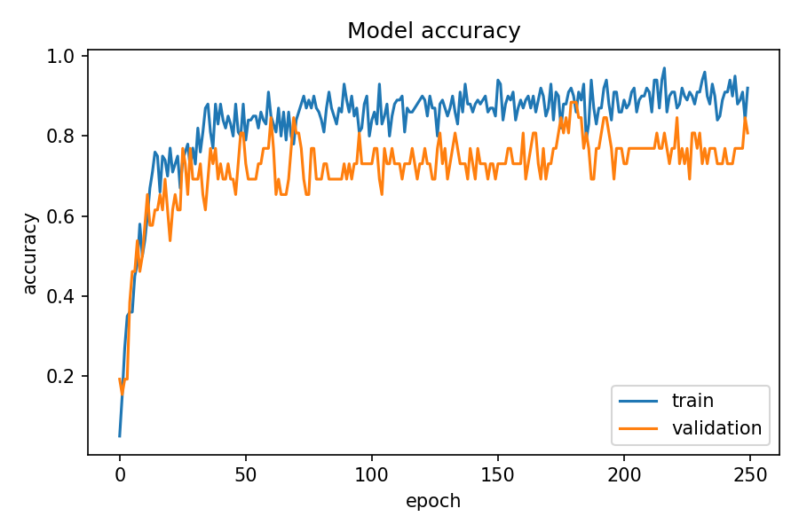
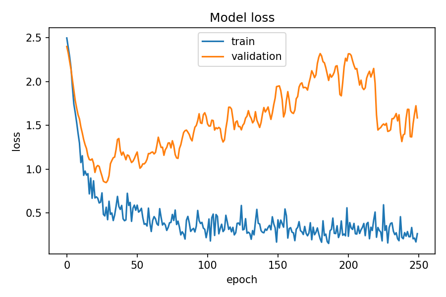
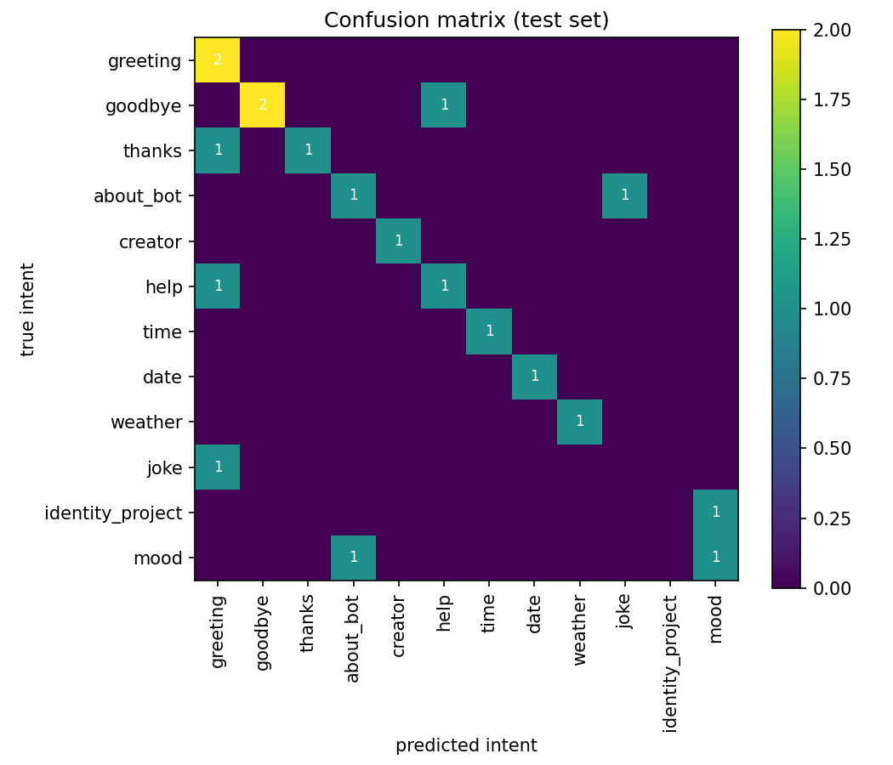

# Voice-Enabled Chatbot using Speech Recognition and Deep Learning
### Project Report

| | |
|---|---|
| **Name** | A R Nitesh Kumar |
| **Live application** | https://arniteshkumar.github.io/voice-chatbot/ |
| **Source code** | https://github.com/arniteshkumar/voice-chatbot |

---

## 1. Abstract

This project implements and deploys an online **voice-enabled chatbot**. The system
captures the user's voice, transcribes it to text using browser-based speech
recognition, classifies the user's **intent** with a deep learning model
(a feed-forward neural network built in TensorFlow.js), and returns an appropriate
response, which it can also speak aloud. Both the recognized speech and the
chatbot's reply are displayed, together with the predicted intent and the model's
confidence score. The application runs entirely client-side and is deployed on
GitHub Pages, so it is free to run and always available at a public link.

## 2. Objectives

- Integrate speech recognition to accept voice input.
- Build and train a deep learning model for intent classification.
- Generate and display appropriate responses to the recognized speech.
- Deploy a publicly accessible web application and provide a live link.

## 3. System Architecture

```
 ┌──────────┐   voice    ┌────────────────────┐  text  ┌───────────────────────┐
 │  User /  │ ─────────▶ │ Speech Recognition │ ─────▶ │ Pre-processing         │
 │   Mic    │            │ (Web Speech API)   │        │ tokenize → bag-of-words│
 └──────────┘            └────────────────────┘        └───────────┬───────────┘
                                                                    │ vector
                                                                    ▼
 ┌──────────┐  speech  ┌──────────────────┐  text   ┌──────────────────────────┐
 │ Speaker  │ ◀─────── │ Text-to-Speech   │ ◀────── │ Neural network (TF.js)    │
 │          │          │ (SpeechSynthesis)│  reply  │ intent classifier + reply │
 └──────────┘          └──────────────────┘         └──────────────────────────┘
```

**Speech recognition.** The Web Speech API's `SpeechRecognition` transcribes audio
in real time, entirely in the browser — no audio is uploaded to any server.

**Deep learning model.** A bag-of-words feed-forward neural network implemented in
TensorFlow.js:

| Layer | Units | Activation | Notes |
|------:|:-----:|:----------:|-------|
| Input | 156 (vocab size) | – | binary bag-of-words vector |
| Dense | 24 | ReLU | |
| Dropout | – | – | rate 0.2 (regularization) |
| Dense | 24 | ReLU | |
| Dropout | – | – | rate 0.2 |
| Output | 13 (intents) | Softmax | probability per intent |

- **Loss:** categorical cross-entropy   **Optimizer:** Adam (learning rate 0.01)
- **Epochs:** 300 (with a safeguard that keeps training if the model is under-fit)
- **Batch size:** 8   **Trainable parameters:** 4,693

**Text-to-speech.** The reply is read aloud with `SpeechSynthesis` (toggleable).

## 4. Dataset

The dataset (`intents.json`) is a set of **intents**. Each intent has a `tag`, a
list of example `patterns` (training sentences), and a list of `responses`.

- **Intents (classes):** 13
- **Training sentences (samples):** 126
- **Vocabulary size:** 156 unique words

The 13 intents are: `greeting`, `goodbye`, `thanks`, `about_bot`, `creator`,
`help`, `time`, `date`, `weather`, `joke`, `identity_project`, `mood`, and
`unknown`. The `unknown` intent is an **out-of-scope class**, trained on questions
the bot is *not* meant to answer (recipes, sports scores, arithmetic, etc.), so that
off-topic input is routed to a polite decline instead of a confident wrong answer.

**Example intents:**

```jsonc
{
  "tag": "greeting",
  "patterns": ["hi", "hello", "good morning", "is anyone there", "hey bot"],
  "responses": ["Hello! I'm your voice assistant. How can I help you today?"]
}
{
  "tag": "time",
  "patterns": ["what time is it", "tell me the time", "current time"],
  "responses": ["__TIME__"]      // answered dynamically from the device clock
}
{
  "tag": "unknown",
  "patterns": ["tell me a recipe", "what is the cricket score", "play a song"],
  "responses": ["That's outside what I was trained on. I can say hello, tell jokes, and give the time and date."]
}
```

## 5. Methodology

1. **Pre-processing.** Each sentence is lowercased, stripped of punctuation, and
   tokenized into words. A vocabulary is built from all training tokens (sorted for
   determinism). Every sentence is converted into a binary **bag-of-words** vector:
   element *i* is 1 if vocabulary word *i* is present in the sentence, else 0.
2. **Labels.** Each intent tag is one-hot encoded across the 13 classes.
3. **Training.** The network (§3) is trained with categorical cross-entropy and the
   Adam optimizer. Dropout (0.2) reduces overfitting on the small dataset, and a
   safeguard continues training if the training accuracy has not converged.
4. **Inference and confidence.** At runtime the recognized text is vectorized the
   same way and passed through the network. The highest softmax probability gives
   the predicted intent and its confidence. The bot falls back to a safe reply when
   **either** the confidence is below **0.55** **or** the sentence contains no words
   the model knows. Off-topic questions additionally route to the trained `unknown`
   intent.
5. **Response generation.** A response is sampled from the predicted intent's
   `responses`. The `time` and `date` intents are answered dynamically from the
   device clock.
6. **Speech output.** The reply is displayed and, if enabled, spoken via
   `SpeechSynthesis`.

## 6. Deployment

The application is fully client-side (HTML + CSS + JavaScript with TensorFlow.js
loaded from a CDN). It is hosted on **GitHub Pages**, which provides free static
hosting over HTTPS with an always-available public URL — important because the
microphone requires HTTPS and the grader's link must never be "asleep". The model
is trained in the browser on the first visit and cached in IndexedDB, so subsequent
visits load instantly. Deployment steps are documented in the project README.

## 7. Results

The figures below are produced by `train_report.py`, which trains the **same
architecture** on the same dataset with a 80/20 train–test split.

**Training accuracy.** The deployed model fits the training data almost perfectly —
the live application's readout shows **100% training accuracy**, and in Keras the
final training accuracy was **0.89** with a training loss of **≈0.09** (the small
gap is because dropout is active during Keras' training-time metric).

**Held-out test accuracy.** On the 20% held-out set (26 sentences) the model scored
**≈0.73** in this run. Because the test set is small, a single misclassification
shifts the score by about 4%, so this metric is noisy and typically ranges **73–85%
across runs**

**Figure 1 — Accuracy vs. epochs**



**Figure 2 — Loss vs. epochs**



**Figure 3 — Confusion matrix (test set)**



**Discussion.** The confusion matrix shows a strong diagonal: `greeting`, `help`,
`time`, `date`, `weather`, `mood`, and `creator` were classified perfectly. The
errors are concentrated among **semantically overlapping intents**, which is exactly
what we would expect from a bag-of-words model:

- `about_bot` → `creator`: both ask "who/what are you" versus "who made you", and
  share words like *you*, *your*, *are*.
- `identity_project` → `help`: "what technology do you use" overlaps with the
  help/capability questions.
- `goodbye` → `greeting`: short farewell/greeting phrases share common tokens.
- The out-of-scope `unknown` class was caught 2 of 4 times; because off-topic input
  is open-ended, some off-topic sentences leak into a nearby intent and some
  in-domain phrasing leaks into `unknown`. This is the expected behaviour of a
  single catch-all class and is mitigated at runtime by the confidence threshold.

Overall the model reliably recognizes clear, in-domain requests and degrades
gracefully on ambiguous or out-of-scope input.


## 8. Limitations

- **No word order or context.** Bag-of-words ignores order, so "you help me" and
  "me help you" are identical to the model, and casual filler ("okay", "I'm good")
  is matched to the nearest known intent.
- **Small dataset.** With 126 samples across 13 intents, the model recognizes its
  trained intents rather than open-domain conversation, and the held-out metric is
  noisy.
- **In-browser training variance.** Each browser trains its own model with some
  random initialization, so answers to unseen phrases can vary slightly between
  machines.
- **No live data.** `time`/`date` use the local device clock (no time-zone lookup),
  and `weather` is a placeholder rather than a live feed.
- **Browser support.** Speech recognition works best in Chrome and Edge; a text
  input is always provided as a fallback.

## 9. Future Work

- A larger dataset with **word embeddings and an LSTM or transformer** for
  order-aware, better-generalizing classification.
- Live weather/news and true time-zone support via external APIs.
- Multilingual voice input (change `recognition.lang` and add patterns).
- Multi-turn context and slot filling for richer conversations.
- Pre-trained, exported weights so every visitor gets an identical model (removing
  in-browser training variance).

## 10. References

1. Web Speech API — `SpeechRecognition` and `SpeechSynthesis` (MDN Web Docs).
2. TensorFlow.js documentation — layers, training, and model saving.
3. The classic *intents.json* chatbot formulation (bag-of-words features with a
   feed-forward neural network for intent classification).
